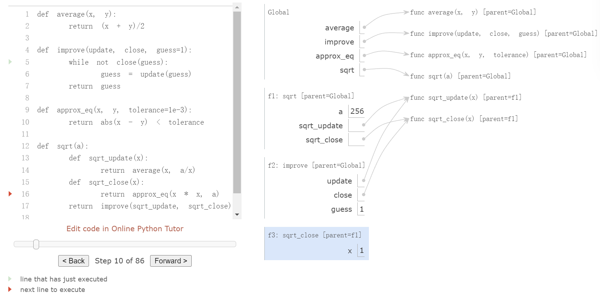
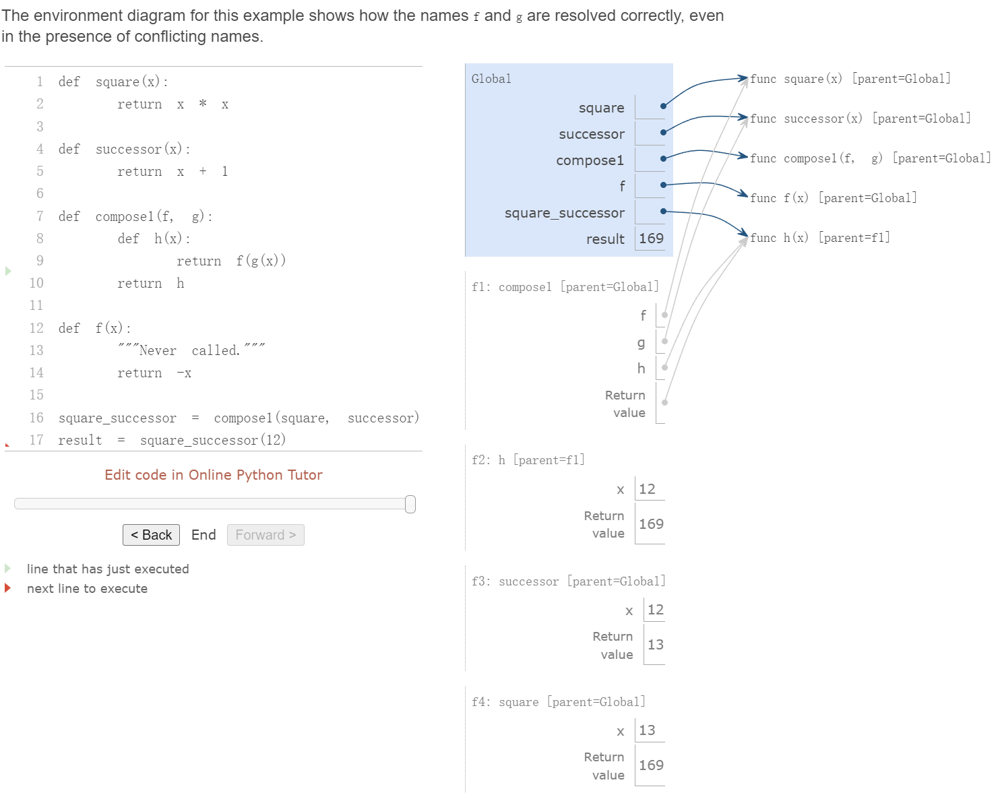
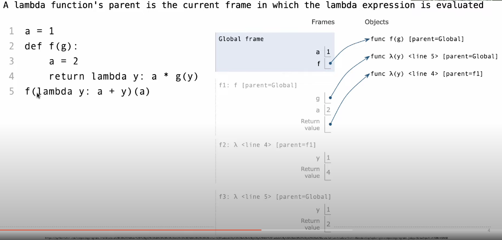
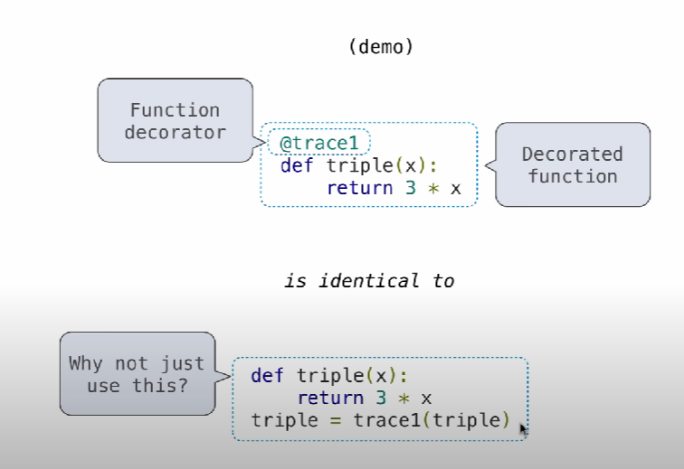

- [1. Higher-Order Functions](#1-higher-order-functions)
  - [1.1. Functions as Arguments](#11-functions-as-arguments)
  - [1.2. Functions as General Methods](#12-functions-as-general-methods)
  - [1.3. Environments for Nested Definitions](#13-environments-for-nested-definitions)
  - [1.4. Functions as Return Values](#14-functions-as-return-values)
    - [1.4.1. Function Composition](#141-function-composition)
  - [1.5. Lambda Expressions](#15-lambda-expressions)
  - [1.6. Function Currying](#16-function-currying)
  - [1.7. Environments for Higher-Order Functions](#17-environments-for-higher-order-functions)
    - [1.7.1. An Example of Environments Diagrams with Lambda](#171-an-example-of-environments-diagrams-with-lambda)
    - [1.7.2. A Challenging Example: Horse Mask](#172-a-challenging-example-horse-mask)
  - [1.8. Decorators](#18-decorators)


> **toolkit**
> https://pythontutor.com/ visualizes the process of computation and the shifting of environment, which are critical to understand the program we write to find a way to debug or improve.

## 1. Higher-Order Functions

Functions that manipulates other functions are called higher-order functions

### 1.1. Functions as Arguments

Consider three summations:

1. summation of consecutive naturals

```python
def sum_naturals(x)
    total, k = 0, 1
    while k <= x:
        total, k = total + k, k + 1
    return total
```

2. summation of consecutive cubed naturals

```python
def sum_cubes(x):
    total, k = 0, 1
    while k <= x:
        total, k = total + k * k * k, k + 1
    return total
```

3. summation of terms in the series which converges to pi very slowly


```python
def sum_pi(x):
    total, k = 0, 1
    while k <= x:
        total, k = total + 8 / ((4*k-3) * (4*k-1)), k + 1
    return total
```

All three summations share a significant part of common pattern, differing only in name and the function of `k` used to compute the term to be added. We could generate each of the functions by filling in slots in the same template:

```python
def <name>(x):
    total, k = 0, 1
    while k <= x:
        total, k = total + <term><k>, k + 1
    return total
```

The presence of such a common pattern is strong evidence that there is a useful abstraction waiting to be brought to the surface. We can do so in Python by taking the common template shown above and transforming the "slots" into formal parameters:

```python
def summation(x, term):
    total, k = 0, 1
    while k <= x:
        total, k = total + term(k), k + 1
    return total
```

In this example, `summation` takes as its two arguments the upper bound `x` together with the function `term` that computes the kth term.

`summation` function takes another function as its arguments. This is a pattern of higher-order function for abstraction.

Then, we define each term as a function that can be called upon into `summation` to form a specific summation.

```python
def identity(x):
    return x #term of consecutive naturals

def cube(x):
    return x * x * x #term of consecutive cubed naturals

def pi_sum(x):
    return 8 / ((4*x-3) * (4*x-1)) #term of a series that infinitely approaches to pi
```

Finally, we can design each of these summations as function to be called to return corresponding computation, in spite of avoiding repeating myself of the same pattern in each by replacing them with `summation` function.

```python
def sum_naturals(x):
    return summation(x, identity)

def sum_cubes(x):
    return summation(x, cube)

def sum_pi(x):
    return summation(x, pi_sum)
```

### 1.2. Functions as General Methods

Designing a function that expresses general methods of computation, independent of the particular functions they call.

Consider the example of computing the golden ratio, which is a number near 1.6 that is obtained by an iterative improvement algorithm. Here is how it goes:

```python
def improve(update, close, guess = 1):
    while not close(guess): #if the `guess` is not close enough, constantly update the number until the ends meet.
        guess = update(guess) 
    return guess
```

This general method begins with a `guess` which can be updated for iteration. It repeatedly applies an `update` function to improve that guess, and applies a `close` comparison to check whether the current `guess` is 'close enough' to be considered correct.

Here are what functions the formal parameter `update` and `close` would call:

```python
def golden_update(guess):
    return 1 / guess + 1 #obtain the golden ratio by repeatedly summing the inverse of any positive number with 1

def square_close_to_successor(guess):
    return approx_eq(guess * guess, guess + 1) #check whether a golden ratio is obtained if the number is one less than its square

def approx_eq(x, y, tolerance=1e-15):
    return abs(x - y) < tolerance #return a boolean value by examining whether the absolute value of the difference between two numbers is small enough to accept
```

By calling three trivial functions, the general method `improve` can abstract away a vast amount of complexity.

```python
>>> improve(golden_update, square_close_to_successor)
1.6180339887498951
```


Last but not least, defining a test to check the general method `improve`'s correctness.

```python
from math import sqrt
phi = 1/2 + sqrt(5)/2
def improve_test():
    approx_phi = improve(golden_update, square_close_to_successor)
    assert approx_eq(phi, approx_phi), "phi differs from its approximation"

>>> improve_test()
```

### 1.3. Environments for Nested Definitions

Nested definitions is a way of constructing functions by compiling one within another by which a hierarchical structure is formed. In order to interpreting the function, a dissection of the structure of the environments is needed, especially of the way of sharing name among nested definition, which is called *lexical scoping*.

Critically, *lexical scoping* follows the fundamental rule that the inner functions have access to the names in the environment where they are defined (**not where they are called**)

We require two **extensions** to our environment model to enable lexical scoping:

1. Each user-defined function has a **parent environment**: the environment in which it was defined
2. When a user-defined function is called, its local frame **extends** its parent environment.

Here is an example of applying the general method `improve` to another case of iteration: square root update. Repeated application of updating `x` to the average of `x` and `a/x`, the square of `x` converges the square root of `a`:

```python
def average(x, y):
    return (x + y) / 2

def sqrt_update(x, a):
    return average(x, a/x)

def sqrt_close(x, a):
    return approx_eq(x * x, a)
```

**This two-argument update function is incompatible with `improve` (it takes two arguments, not one)**, and it provides only a single update, while we really care about taking square roots by repeated updates. The solution is to design a nested definition by placing function definitions inside the body of the other definitions:

```python
def sqrt(a):
    def sqrt_update(x): #notice here the two-argument update is replaced by the one-argument, since its parental function only defines one argument for extension.  
        return average(x, a/x)
    def sqrt_close(x): #defines one-argument out of the same reason
        return approx_eq(x * x, a)
    return improve(sqrt_update, sqrt_close)
```

**the dissection of its environments**:



Previous to `sqrt`, all functions were defined in the global environment where `sqrt`'s parent frame lies. By contrast, when Python evaluates the first two clauses of `sqrt`, it creates functions `sqrt_update` and `sqrt_close` that are associated with a local environment, and a value `a` that its functions can refer to. 

The environment first adds a local frame for `sqrt` and evaluates the `def` statements for `sqrt_update` and `sqrt_close`.

Within the body of `improve`, we must apply out `update` function (bound to `sqrt_update`) to the initial guess `x` of 1. This final application creates an environment fo `sqrt_update` that begins with a local frame containing only `x`, but with the parent frame `sqrt` still containing a binding for `a`.

The critical part here is that the frame created by calling `sqrt_update` inherits bindings from its parent frame `f1`. 

This nested way of definitions can construct an environment, called *Extended Environment*, that consists of an arbitrarily long chain of frames, which always concludes with the global frame. In the case of the environment for the call to `sqrt_update`, it consists of three frames: 

1. the local `sqrt_update` frame,
2. the `sqrt` frame in which `sqrt_update` was defined,
3. and the global frame

By following this chain of frames, the value for `a` is defined within its parent frame `sqrt`.

### 1.4. Functions as Return Values

> An important feature of lexical scoped programming is that locally defined functions maintain their parent environment when they are returned. 

By utilizing the feature above, we can create *function composition* which means a natural method of combination to include in our programming language.

#### 1.4.1. Function Composition

Given two functions `f(x)` and `g(x)`, we might want to define `h(x) = f(g(x))`:

```python
def composel(f, g):
    def h(x):
        return f(g(x))
    return h
```



### 1.5. Lambda Expressions

`lambda` expression enables us to create functions on the fly without explicitly naming it.

```python
def composel(f,g):
    return lambda x: f(g(x))
```

The structure of `lambda` expression:

$$\begin{array}{ccc}
lambda&x&:&f(g(x))&\\
\text{A function that}&\text{takes }x&\text{and returns}&f(g(x))&
\end{array}
$$

An important difference between the `lambda` expression and other functions is that, it has no intrinsic name such that Python prints `lambda` for the name.

```python
>>> s = lambda x: x * x
>>> s
<function <lambda> at 0xf3f490>
>>> s(12)
144
```

One big caveat for creating `lambda` expressions:

- Avoid compounding `lambda` expressions that would be notoriously illegible, despite their brevity (this way of coding is implemented out of its brevity while in practice)
  - `compose1 = lambda f,g: lambda x: f(g(x))`
    - which means, the lambda function takes function `f` and function `g` and returns a lambda function within that takes `x` to return `f(g(x))`. The way to call it is this: `compose1(f, g)(x)`
  - another example of lambda expression compounding through forcing its arguments equal some outside value:
    - `compose2 = (lambda f,g: lambda x: f(g(x)))(add, mul)`. This expression forces the functional arguments of `compose2` function equal to `add` and `mul`, and passes that to the expression within that calls `x` upon the outside function.


### 1.6. Function Currying

*Function currying* is a feature of higher-order function that can be utilized to convert a function take makes multiple arguments into a chain of functions that each take a single argument.

Given a function `f(x,y)`, we can define a function `g` such that `g(x)(y)` is equivalent of `f(x,y)`. Here, `g` is a higher-order function that takes in a single argument `x` and returns another function that takes in a single argument `y`.

```python
def curry(f):
    """Return a curried version of the given two-argument function."""
    def g(x):
        def h(y):
            return f(x,y)
        return h
    return g
```

Its inverse version is called *uncurrying*

```python
def uncurry(g):
    """Return a two-argument version of the given curried function."""
    def f(x, y):
        return g(x)(y)
    return f
```

The `curry` function takes in a two-argument function `f` and returns a single-argument function `g`. When `g` is applied to an argument `x`, it returns a single-argument function `h`. When `h` is applied to `y`, it calls `f(x, y)`. Thus, `curry(f)(x)(y)` is equivalent to `f(x, y)`. The `uncurry` function reverses the currying transformation, so that `uncurry(curry(f))` is equivalent to `f`.

Example: a curried version of the `pow` function:

```python
def curried_pow(x):
    def g(y):
        return pow(x, y)
    return g

>>> curried_pow(2)(5)
32
```

Some programming languages, such as Haskell, only allow functions that take a single argument, so the programmer must curry all multi-argument procedures. In more general languages such as Python, currying is useful when we require a function that takes in only a single argument. For example, the `map` pattern applies a single-argument function to a sequence of values.

### 1.7. Environments for Higher-Order Functions


#### 1.7.1. An Example of Environments Diagrams with Lambda

```python
>>> a = 1
>>> def f(g):
        a = 2
        return lambda y: a * g(y)
>>> f(lambda y: a + y)(a)
4
```

```python
# Global Frame
f(g): lambda y: a + y # f3
a: 1

# f1: f [parent = global]
g: lambda y: a + y # f3 
a: 2 # local frame
return value: lambda y: a * g(y) >>> [f2]

# f2: lambda_1 [parent = f1]
y: 2 # f3
a: 2 # passed down from its parent frame f1
g: lambda y: a + y # f3
return value: a * g(y) = 2 * 2 = 4

# f3: lambda_2 [parent = global]
a: 1 # be passed down from global value a = 1
y: a = 1 # input as curried by the a in the second brackets,
         # which is defined by the global value a = 1
return value: a + y = 1 + 1 = 2
```



#### 1.7.2. A Challenging Example: Horse Mask

```python
>>> def horse(mask):
        horse = mask
        def mask(horse):
            return horse
        return horse(mask)

>>> mask = lambda horse: horse(2)

>>> horse(mask)

```

### 1.8. Decorators

Decorator is a special Python syntax that binds the name of a function to the returned function value of a higher-order function that calls on the former function.

For example, here are two functions `trace` and `triple`. 

```python
def trace(fn):
    def traced(x):
        print("call", fn, "on the argument", x)
        return fn(x)
    return traced

def triple(x):
    return x * 3
```

We are suppose to make `triple` as the argument function to be taken by the higher-order function `trace`, and bind it to `triple` that updates the function. Here we can use decorator `@trace` syntax.

```python
@trace
def triple(x):
    return x * 3
```

It is same as:

```python
def triple(x):
    return x * 3
triple = trace(triple)
```

And then, by calling `triple(3)`, it returns `trace(triple(3))` which prints the defined expression by the body of `trace` that precedes the return of the value of `triple(3)`:

```python
>>> triple(3)
call <function triple at 0x00000212E06B05E0> on the argument 3
9
```



`@func` syntax makes the binding procedure at least more intuitive to Python programmers.

The decorator symbol `@` may also be followed by a call expression. The expression following `@` is evaluated first (just as the name `trace` was evaluated above), the `def` statement second, and finally the result of evaluating the decorator expression is applied to the newly defined function,