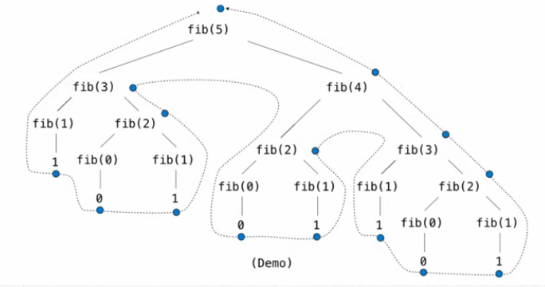

### Every loop can be expressed as a recursive call

### The anatomy of recursive functions:

There are three main steps in a recursive definition:

1. **Base case**. The case of the simplest function input, or as the stopping condition for the recursion.

2. **Recursive call on a smaller problem**. We assume that a recursive call on this smaller problem will give us the expected result; we call this idea the "_recursive leap of faith_".

3. **Solve the large problem**. Given the result of a smaller problem, we want to use the resilt to figure out what the result of our current problem should be, which is what we want to return from our current function call.

### Tree recursion

A function with multiple recursive calls is said to be _tree recursive_ because each call branches into multiple smaller calls, each of which branches into yet smaller calls, just as the branches of a tree become smaller but more numerous as they extend from the trunk.

The most famous example is the Fibonacci numbers

```python
1	def fib(n):
2	    if n == 1:
3	        return 0
4	    if n == 2:
5	        return 1
6	    else:
7	        return fib(n-2) + fib(n-1)
8	
9	result = fib(6)
```



### Some recursive examples

##### Luhn algorithm

```python
def luhn_sum(n):
     if n<10:
         return n
     else:
         all_but_last, last = n // 10, n % 10
         return luhn_sum_double(all_but_last) + last


def luhn_sum_double(n):
    all_but_last, last = n // 10, n % 10
    luhn_digit = sum_digits(2*last)
    if n<10:
        return luhn_digit
    else:
        return luhn_sum(all_but_last) + luhn_digit


def sum_digits(n):
    if n<10:
        return n
    else:
        all_but_last, last = n // 10, n % 10
        return sum_digits(all_but_last) + last
```

or

```python
def luhn_sum(n):
    if n<10:
        return n
    else:
        all_but_last, last = n // 10, n % 10
        def luhn_sum_double(x):
            all_but_last, last = x // 10, x % 10
            luhn_digit = sum_digits(2*last)
            if x < 10:
                return luhn_digit
            else:
                return luhn_sum(all_but_last) + luhn_digit
    return luhn_sum_double(all_but_last) + last
```

##### inverse cascade function


```python
def f_then_g(f,g,n):
    if n:
        f(n)
        g(n)

def inv_cascade(n):
    grow(n)
    print(n)
    shrink(n)

grow = lambda n: f_then_g(grow, print, n//10)
shrink = lambda n: f_then_g(print, shrink, n//10)
```

##### Counting partition
The number of partitions of a positive integer n, using parts up to size m, is the number of ways in which n can be expressed as the sum of positive integer parts up to m in increasing order.

Strategy

- Recursive decomposition: finding simpler instances of the problem.
- Explore two possibilities: 
  - Use at least one 4
  - do not use any 4
- Solve two simpler problems
  - count_partitions(2,4) # use at least one 4
    - Decomposing into two new possibilities
      - use at least one 4
      - do not use any 4
  - count_partitions(6,3) # do not use any 4
    - Decomposing into two new possibilities
      - use at least one 3
      - do not use any 4
- Tree recursion often involves exploring different choices

```python
def count_partitions(n,m):
    """
    
    >>> count_partitions(6,4)
    2+4 # cases using at least one 4
    1+1+4 
    -----
    3+3 # cases that do not use any 4
    1+2+3
    1+1+1+3
    2+2+2
    1+1+2+2
    1+1+1+1+2
    1+1+1+1+1+1
    >>> 9
    """
    if n == 0:
        return 1
    elif n < 0:
        return 0
    elif m == 0:
        return 0
    else:
        with_m = count_partition(n-m, m)
        without_m = count_partition(n, m-1)
        return with_m + without_m

```
